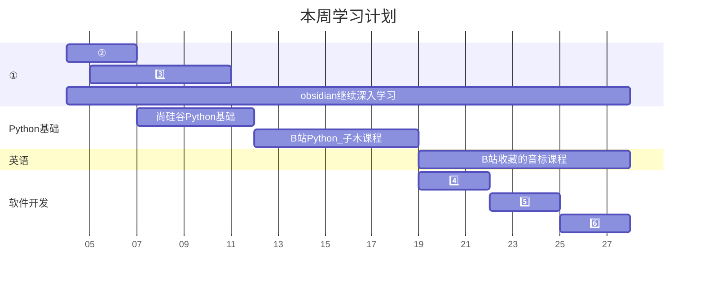
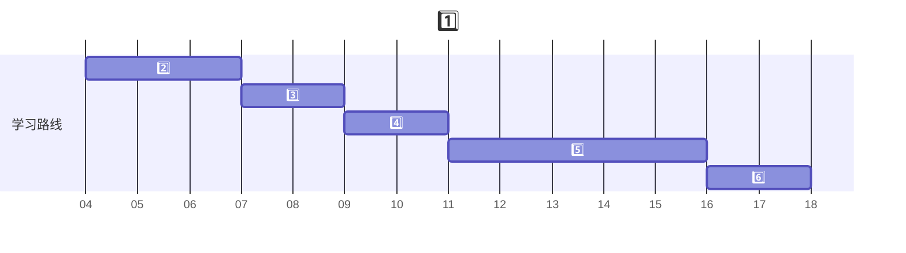

# 锚点链接

>锚点链接用于在同一文档内跳转，特别适合长文档的导航：

## 标题锚点
**例如：**

- [锚点链接](#锚点链接)
  - [标题锚点](#标题锚点)
    - [第一章：介绍](#第一章介绍)
    - [第二章：安装](#第二章安装)
    - [第三章：使用方法](#第三章使用方法)
  - [手动创建锚点](#手动创建锚点)
    - [自定义锚点位置](#自定义锚点位置)
- [跨文档锚点演示](#跨文档锚点演示)


### 第一章：介绍
这里是介绍内容...

### 第二章：安装
这里是安装说明...

### 第三章：使用方法
这里是使用说明...


>>锚点规则：
>>标题会自动生成锚点
锚点名称通常是标题的小写形式
空格替换为连字符
移除特殊字符
无论是几级标题，都使用一个#

## 手动创建锚点

<a id="custom-anchor"></a>
### 自定义锚点位置

中间的甘特图毫不相干，是为了在锚点和锚点链接中间插入一段隔开的内容


| 标号  | 详情                                                                                          |     |
| --- | ---------------------------------------------------------------------------------------------- | --- |
| 1️⃣ | markdown 与 Mermaid 的学习路线规划                                                                 |     |
| 2️⃣ | markdown 的菜鸟教程和https://www.markdown.cn/ 这个网站，结合着详细看一遍，把现有的 markdown项目里面的笔记，补充完整，然后推送到 gitHub                                                   |     |
| 3️⃣ | Mermaid 的学习，主要是https://mermaid.nodejs.cn/ 这个网站，重点是掌握甘特图。其他图知道具体是什么图，这种图是干什么用的简单看一遍上面这个网站里面的语法                                                                              |     |
| 4️⃣ | markdown 的练习文档，练习3 篇                                                                       |     |
| 5️⃣ | 看了不起的 markdown 这本书的第 2 版，全部看完                                                         |     |
| 6️⃣ | 练习完剩余的 markdown 文档                                                                         |     |

[跳转到自定义位置](#custom-anchor)


# 跨文档锚点演示

**语法:**

```
[链接文字](路径/文件名.md#锚点ID)
```

例如：

[lession-06中的其中一个标题](../package-01/markdown-lession-06.md#在线教程)

> 注意：跨文档的锚点，只支持markdown 的标题的锚点，不支持跨文件的HTML锚点